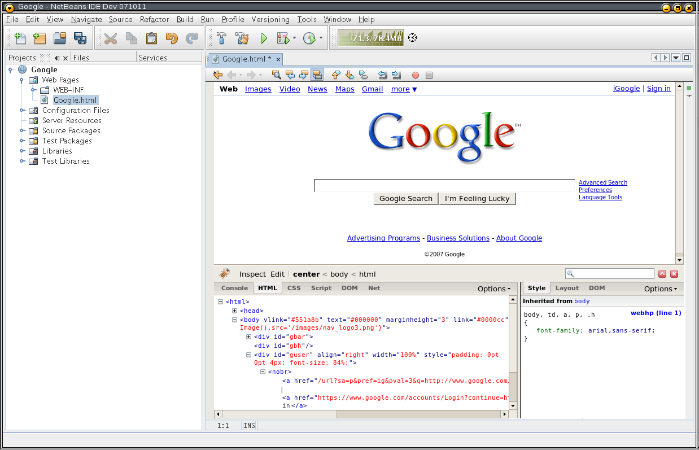
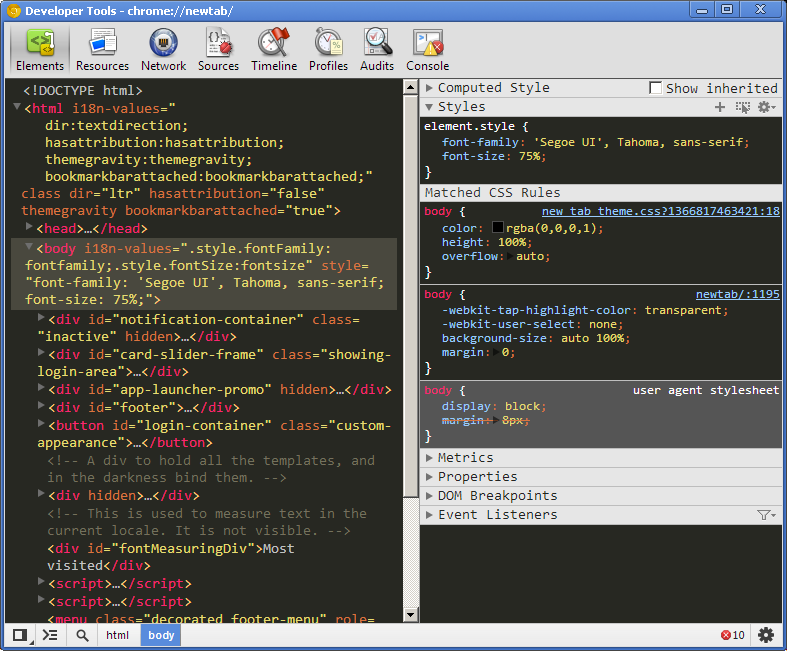
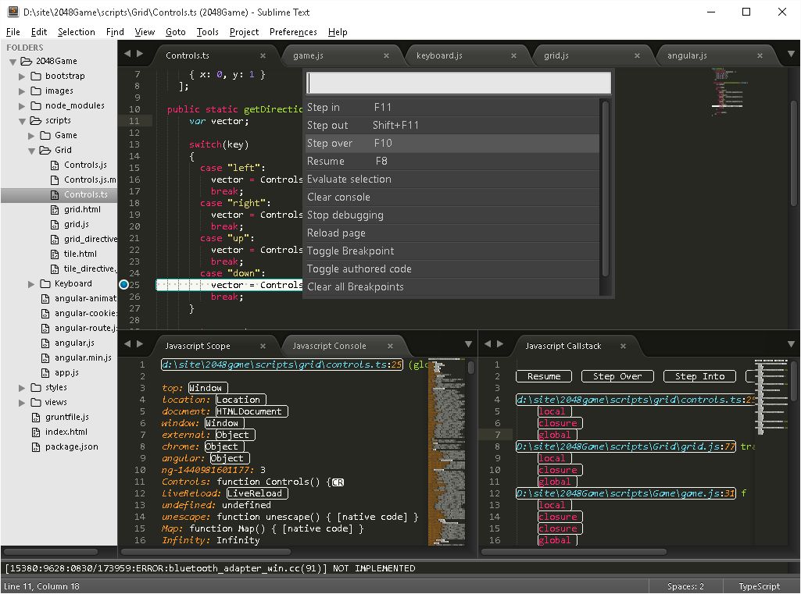

## Using Visual Studio Code

* 📄 [Awesome Documents](./markdown.md)
* 🐞 [Debugging](./debugging.md)
* 🚀 [Launch Configuration](./launch-configuration.md)
* ✅ [Type-Checking](./type-checking.md)

---

### The best way to get to know this editor...

> Let's use it to do some stuff!

> Here's our example 
> It's a client/server app, built with bleeding edge versions of everything
>   - [React 16 (beta)](https://github.com/facebook/react/issues/10294)
>   - [Webpack 3](https://webpack.js.org/)
>   - [Babel 7](http://babeljs.io/)
>   - [TypeScript 2.5](https://blogs.msdn.microsoft.com/typescript/2017/08/31/announcing-typescript-2-5/)
>   - [Koa](http://koajs.com/)

> This is intended to show you the most modern stuff available. 95% of this can be done in older versions too!

> Take a moment now to ensure you're all set up.
>   First, make sure you're running a recent version of Node.js
>   ```sh
>   node --version # v7.10.0
>   ```
>   And we need a library called sqlite3 for our database. You can check your version by running
>   ```sh
>   # If you don't have it yet
>   brew install sqlite3
>   # If you already have it
>   sqlite3 --version # 3.16.0 2016-11-04...
>   ```
>   And it's helpful to have a package manager called yarn
>   ```sh
>   # If you don't have it yet
>   brew install yarn
>   # If you already have it
>   yarn --version # 0.27.5
>   ```
>   ```sh
>   git clone https://github.com/mike-north/vscode-fundamentals vscode
>   cd vscode
>   yarn
>   npm start
>   ```

### Debugging Node.js

> Node has no gui, so the built-in debugging experience is 🤢 (vomoticon). Let's take a look!

```sh
npm run debug
```

> Thankfully, in [May 2016](https://www.youtube.com/watch?v=x8u0n4dT-WI&feature=youtu.be&t=2571) we got a new flag that basically
>   - 🛑 Suspends global node.js execution on the first line of code
>   - 🔗 Gives us a URL to open w/ chrome

```sh
npm run debug:attach
```
Under the hood, this runs `node --inspect`.

<br><br><br><br>

### Debugging w/ Editors

> This still involves a ton of context switching
>   - 👎 Yes, this is a bad thing
>   - 🔫 Multitasking stockholm syndrome
>   - 🐟 Seems like we've been floundering around for a decade trying to get this right







> 👆 this one was/is actually really cool, but...
> - insanely hard to set up
> - and brittle,
> - and looks like it works
> - but it doesn't really

> There are some [community sourced Atom plugins](https://atom.io/packages/node-debugger)


> But these plugins are complex and need a HUGE amount of effort to get right
>  - sourcemaps
>  - advanced debugging features
>  - asynchrony
>  - multiple threads
>  - multiple debugging sessions

<br><br><br><br>

### Debugging w/ VS Code

> 1. Start node with the same `--inspect` flag
> ```
> npm run debug: attach
> ```
> 2. Open the **Debugger** side panel
> 3. Create a new "launch configuration"
> 